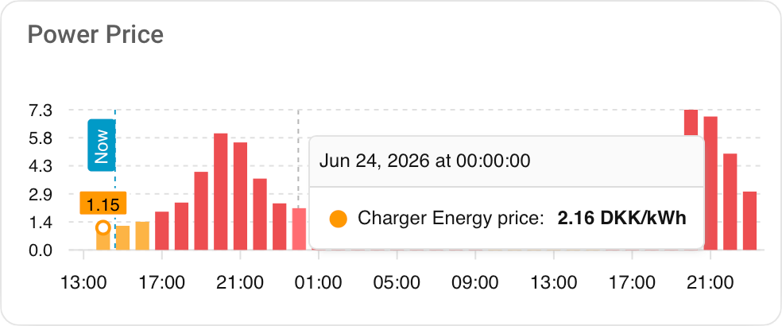
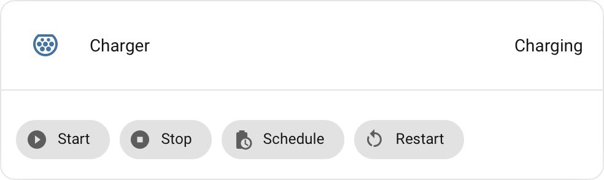
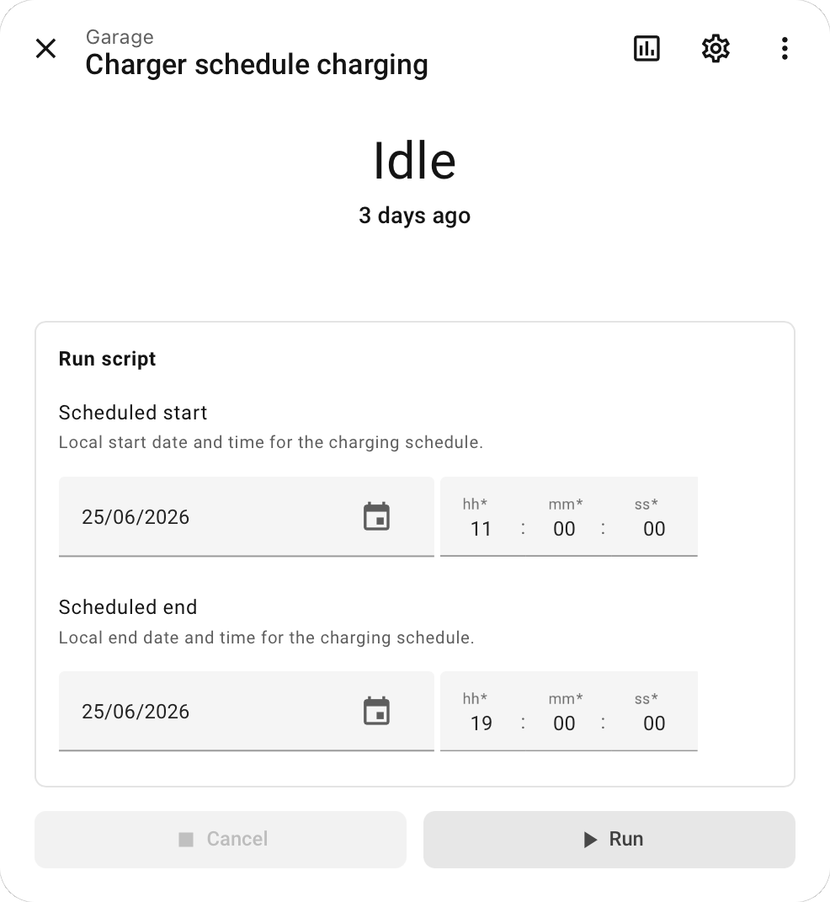

# Usage Examples

These examples are starting points. Entity IDs depend on your charger name and Home Assistant's
entity registry, so adjust them after setup.

## ApexCharts Energy Price

Use the integration's energy price sensor entity in ApexCharts. The exact entity ID depends on your
charger name. This example uses the normalized `prices` timeline attribute, a 34-hour rolling window,
and a one-hour left offset. The tooltip value unit is inherited from the entity's
`unit_of_measurement`.

<p>
  
</p>

```yaml
type: custom:apexcharts-card
apex_config:
  chart:
    height: 150px
  xaxis:
    tooltip:
      enabled: false
graph_span: 34h
span:
  start: hour
  offset: "-1h"
series:
  - entity: sensor.charger_energy_price
    type: column
    show:
      extremas: min
    float_precision: 2
    data_generator: |
      return (entity.attributes.prices || []).map((row) => {
        return [new Date(row.start).getTime(), row.price];
      });
```

## Compact Charger Controls

Use the connector status sensor as the main entity and call OK actions from buttons or scripts. The
service actions target Home Assistant entities, so dashboards do not need raw OK charger IDs. The
restart button is disabled by default in the entity registry; enable it first if you want it on a
dashboard.

<p>
  
</p>

```yaml
type: entity
entity: sensor.charger_connector_status
name: Charger
footer:
  type: buttons
  entities:
    - entity: button.charger_start_charging
      name: Start
    - entity: button.charger_stop_charging
      name: Stop
    - entity: script.schedule_ok_charging
      name: Schedule
    - entity: button.charger_restart
      name: Restart
```

## Schedule Charging Script Blueprint

The repository includes a script blueprint for creating a reusable OK charging schedule script:
`blueprints/script/ok/schedule_charging.yaml`.

Use this blueprint when you want a dashboard button or script call that prompts for
`scheduled_start` and `scheduled_end`, while keeping the OK connector status entity selected once in
the script setup.

### Import

Use one of these methods:

- **One-click import**:

  [](https://my.home-assistant.io/redirect/blueprint_import/?blueprint_url=https%3A%2F%2Fraw.githubusercontent.com%2FRaMin0%2Fhomeassistant-ok%2Fmain%2Fblueprints%2Fscript%2Fok%2Fschedule_charging.yaml)
- **Import from URL**: In Home Assistant, go to **Settings > Automations & scenes > Blueprints**,
  choose **Import blueprint**, and use the raw GitHub URL for
  `blueprints/script/ok/schedule_charging.yaml`.
- **Manual copy**: Copy the file to
  `config/blueprints/script/ok/schedule_charging.yaml`, then reload scripts/blueprints or restart
  Home Assistant.

The one-click import flow still imports from a URL and uses the current `main` branch. To avoid
GitHub/repository URLs, use the manual copy method; Home Assistant will load the local blueprint from
`config/blueprints/script/ok/schedule_charging.yaml`.

### Use

Create a new script from the blueprint, select the OK connector status sensor once, then call that
script from a dashboard button. Home Assistant prompts for `scheduled_start` and `scheduled_end`
when the script runs.

<p>
  
</p>

To edit an existing schedule after it has been created, use the schedule from and schedule to
datetime entities. They show the current OK schedule values and open Home Assistant's native
datetime picker.

The integration does not create scripts automatically and does not modify `scripts.yaml`.

### Equivalent Script Action

```yaml
sequence:
  - action: ok.schedule_charging
    data:
      entity_id: sensor.charger_connector_status
      scheduled_start: "2026-06-17T23:00:00"
      scheduled_end: "2026-06-18T06:00:00"
```
